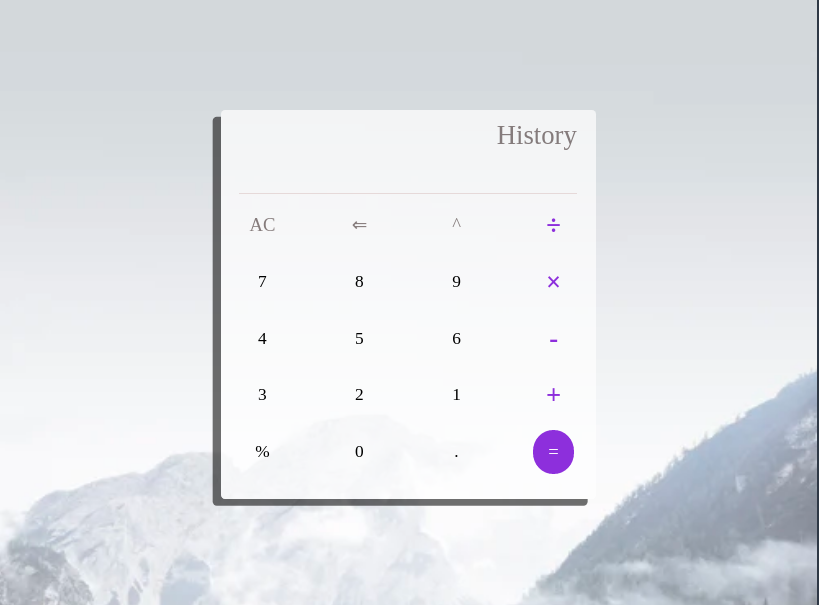

# Basic calculator

A simple calculator using HTML, CSS, javascript and lots of sweat.

## link to the live project <a href="https://prince-hope1975.github.io/Simple_Calculator/">here</a>

This is a very simple calculator with basic functionality of addition, subtrction, multiplication, division, power and more coming soon...

# Steps to execute the calculator:
<ul>
   <li> You can fork this project and clone the code into your machine. From ther simply click on the file labelled index.html andyoure good to go
   <li>or simply click <a href="https://prince-hope1975.github.io/Simple_Calculator/">here </a> to go to the ready to use <a href="https://prince-hope1975.github.io/Simple_Calculator/">calculator</a>
 </ul>